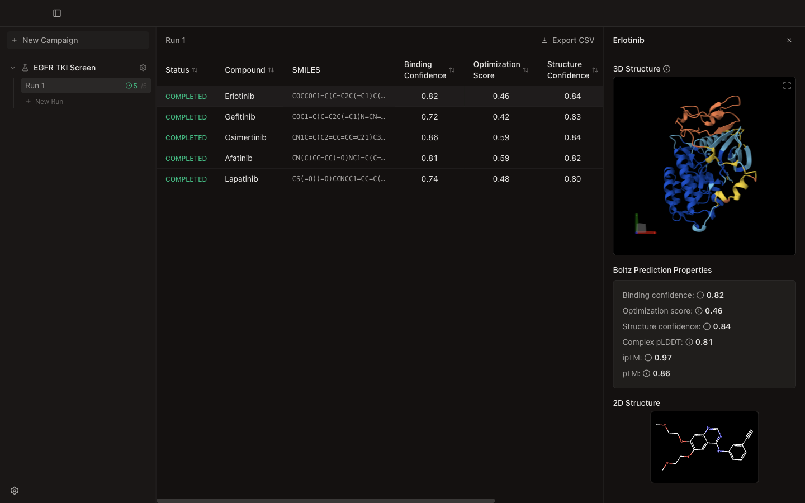

  

<h1 align="center">Multiplexer</h1>

  Batch molecular docking with the <a href="https://lab.boltz.bio">Boltz Lab</a> API. 
  A macOS desktop app for screening compounds against protein targets.

  

## What it does

Multiplexer lets you submit batches of small molecules against a protein, DNA, or RNA target using Boltz Lab's cloud structure prediction API. Paste a list of SMILES or upload a CSV, hit submit, and review predicted 3D structures and binding metrics in a single desktop interface.

Results come back with six metrics per compound — binding confidence, optimization score, structure confidence, complex pLDDT, ipTM, and pTM. You can sort, compare, and export to CSV without leaving the app.

## Download

<!-- REPLACE: UPDATE THESE LINKS WITH ACTUAL GITHUB RELEASE ASSET URLS ONCE GITHUB RELEASES (P0 #11) IS SET UP -->

| | Apple Silicon (M1/M2/M3/M4) | Intel |
|---|---|---|
| macOS | [Download .dmg](https://github.com/AshXuAn/multiplexer/releases/latest/download/Multiplexer-arm64.dmg) | [Download .dmg](https://github.com/AshXuAn/multiplexer/releases/latest/download/Multiplexer-x64.dmg) |

Requires macOS 12 or later. The app is code-signed and notarized by Apple.

## Getting a Boltz API key

1. Go to [lab.boltz.bio](https://lab.boltz.bio) and create an account.
2. Generate an API key from your dashboard.
3. Your key will start with `boltzpk_live_`.

## Quick Start

1. **Install** — Open the `.dmg` and drag Multiplexer to Applications.
2. **API key** — Open Multiplexer, go to Settings, paste your Boltz API key. It auto-verifies.
3. **New campaign** — Click "New Campaign". Name it, choose target type (Protein, DNA, or RNA), and paste the target sequence.
4. **Add compounds** — Click "New Run" under your campaign. Paste SMILES (one per line, or `name,SMILES`), or upload a CSV/TSV file.
5. **Submit** — Click Submit. Compounds are sent to Boltz Lab in parallel (5 concurrent, with automatic rate-limit handling).
6. **Review** — Click any completed compound to see the predicted 3D structure, PAE heatmap, and all six prediction metrics.
7. **Export** — Click "Export CSV" to download a ranked table of all results.

## Features

**Input**
- Paste SMILES or name,SMILES pairs
- Upload CSV/TSV files with automatic column detection
- Drag-and-drop file import (.csv, .tsv, .smi)
- Protein, DNA, and RNA target sequences (FASTA supported)
- Real-time SMILES validation via RDKit

**Screening**
- Batch concurrent submission (5 at a time)
- Automatic rate-limit handling for large batches
- Configurable model parameters (recycling steps, diffusion samples, sampling steps, step scale)
- Desktop notifications on run completion

**Review**
- Interactive 3D structure viewer (Mol*)
- PAE heatmap
- Six metrics: Structure Confidence, Complex pLDDT, ipTM, pTM, Binding Confidence, Optimization Score
- Sortable results table with keyboard navigation
- CSV export

**App**
- Light and dark mode
- Resizable panels
- Code-signed and notarized for macOS

## Tech Stack

Electron, React, TypeScript, Tailwind CSS, tRPC, Mol\*, RDKit WASM, Zustand

## License

[MIT](LICENSE)
